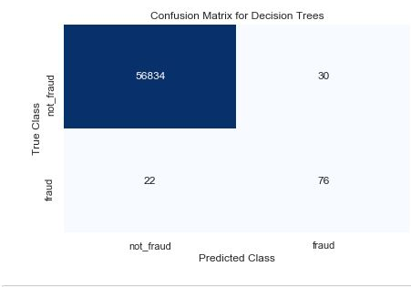
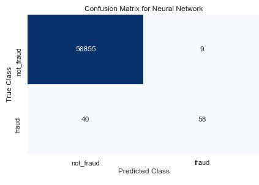

# Credit-Card-Fraud-Detection-Using-Different-ML-Techniques
This project focuses on comparing the results for Logistic Regression, Decision Trees and Neural Networks for Credit Card Fraud Detection 

# Dataset

The Dataset used for this project is the Kaggle dataset for Credit Card fraud Detection and can be found <a href="https://www.kaggle.com/mlg-ulb/creditcardfraud">here</a>.
The dataset consists of 29 features and one label column (binary where 1 is fraud transaction and 0 is non-fraud transaction).

# Result

The result can be seen as follows :

          

The neuralnet gave a slight better result where it detected 75 fraud transactions and 56849 Non-Fraud transactions (Most number of True Positives).
The accuracies were as follows:

  Neural Network      ~= 99.93
  Logistic Regression ~= 99.91
  Decision Trees      ~= 99.908

# Issues

The issue is that the number of fraud transactions are not distributed uniformly. The fraud data needs to be increased so that the algorithms could learn more features and hence the accuracy will increase. The current distribution is as follows:

  Non-Fraud Transactions :  284315
  Fraud Transactions     :  492
  
Also, the features provided in the dataset are not known for security reasons (just named V1,V2,V3,...) and it is hard to get an original dataset. If the inputs are known they can be further processed to get more useful features.
